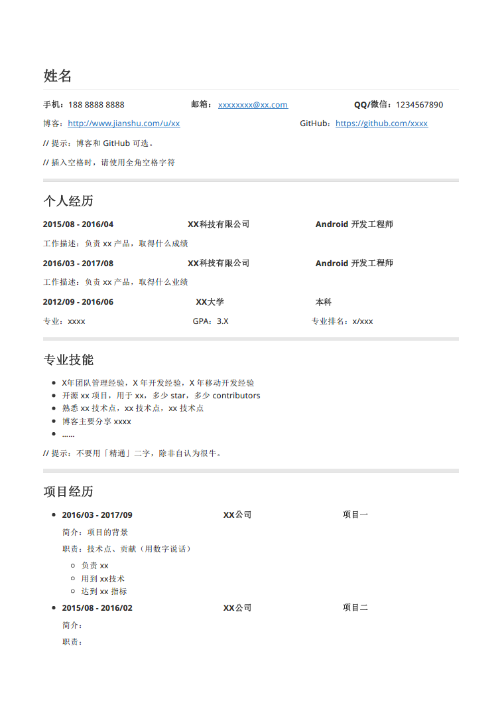

特别推荐 **[超级简历](https://www.wondercv.com/)**，排版和内容非常美观，和下面的简历模版类似。优点是更加紧凑，一页纸就能搞定哦！

--------

### 程序员简历模板

一个简洁使用的程序员简历模板，感谢 [Trinea](https://github.com/Trinea) 的指导——[推荐两个技术简历模板](http://b.codekk.com/detail/Trinea/%E6%8E%A8%E8%8D%90%E4%B8%A4%E4%B8%AA%E6%8A%80%E6%9C%AF%E7%AE%80%E5%8E%86%E6%A8%A1%E6%9D%BF)

推荐使用 **[Typora](https://typora.io/)** 软件打开 .md 文件，然后一键导出 PDF 即可。

这份简历看起来是这个样子，希望对找工作的你有帮助 :)

